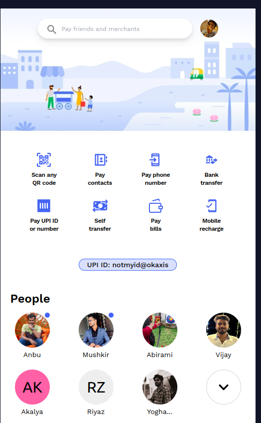
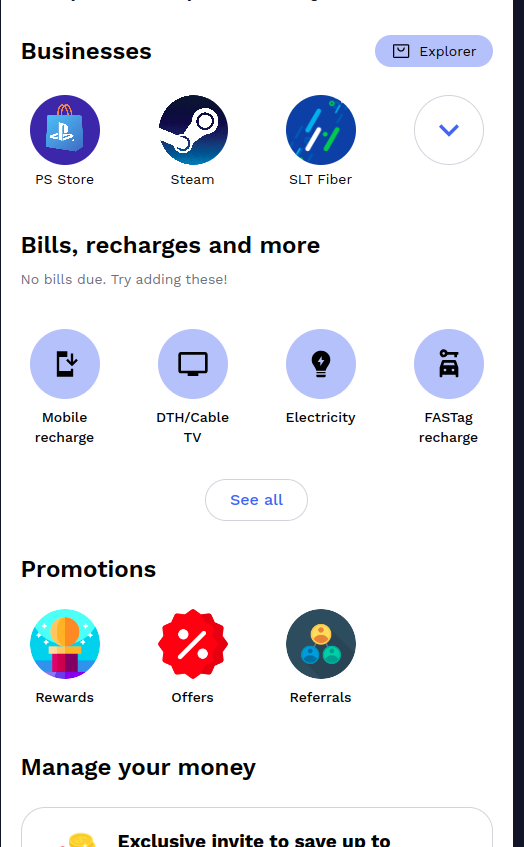
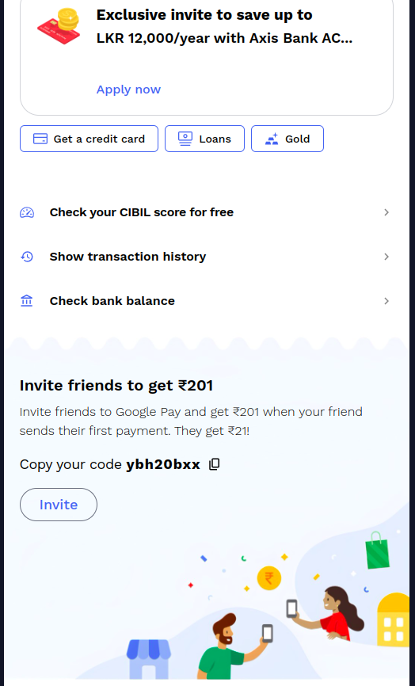

# Google Pay UI Challenge By Shajid 🚀

Cyberdude Networks Pvt. Ltd Internship Project # 4 - **Google Pay UI Challenge**.

## Table of Contents
- [Google Pay UI Challenge By Shajid 🚀](#google-pay-ui-challenge-by-shajid-)
  - [Table of Contents](#table-of-contents)
  - [Description](#description)
  - [Demo](#demo)
  - [Internship](#internship)
  - [Technologies Used](#technologies-used)
  - [Features](#features)
  - [Contributing](#contributing)
  - [License](#license)
  - [Acknowledgments](#acknowledgments)

## Description

This UI challenge gave me a confident on using Vite and Tailwind CSS also including building and deployment made easy for me without any errors at first. All thanks to **Akalya** - https://github.com/MUTHUAKALYA for all the sketches and wire frames of the app. Because we didn't have the app in our country to understand the UI. 
 

## Demo

✨**Live Link is Here**: https://mshajid.github.io/gpay-ui-challenge/
 
 

 

 

## Internship

This internship is provided by [CyberDude Networks Pvt. Ltd.](https://youtube.com/cyberdudenetworks) as part of the 6-Month Free Internship program, a skill development initiative organized to enhance participants' skills. Mentoring was provided by [Mr. Anbuselvan Rocky](https://instagram.com/anbuselvanrocky). For more information, [you can contact CyberDude Networks here](https://cyberdudenetworks.com).

## Technologies Used

HTML 5 | Tailwind CSS | Vite

## Features

- Scroll X & Y Axis scroll on status and chats.
- Dark mode enabled (manually without tailwind)
- Status rings.
- Special chats.
- Floating icons.

## Contributing

Feel free to contribute to this project by "Forking" this repo, and Add a PR for any additional features that can be added this UI Challenge. 

## License

MIT

## Acknowledgments
Special thanks to [Muthu Akalya (GitHub)](https://github.com/MUTHUAKALYA), Who helped me to skecth the section UI and clarified my doubts about the UI Instantly. 

Special thanks to [Vasanth (Github)](https://github.com/vk2401) for relevant banners and assets.

Special thanks to [Muthukumari](https://github.com/muthukumarimoorthi), [Swetha](https://github.com/swethadsalvatore) & [Sathesh]() for their instant replies on the first UI section with the images, then I started to analyze how UI should be structured. 

---

  

